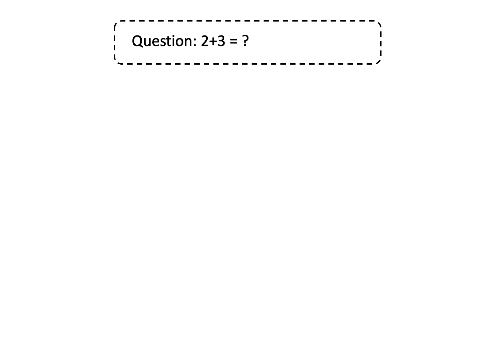
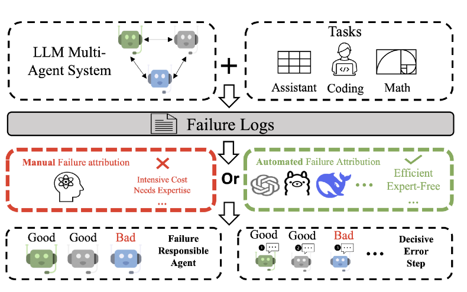
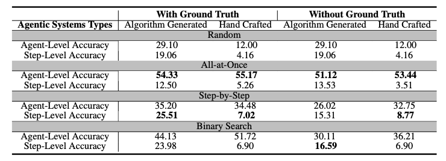
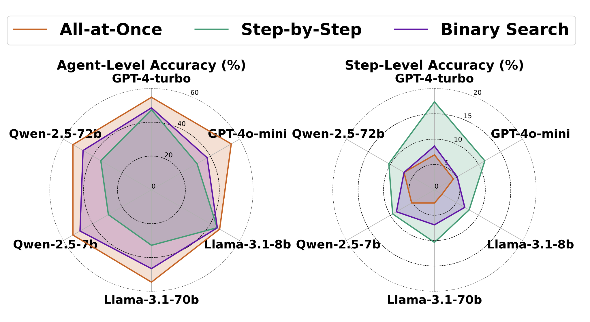

# Which gent Causes Task Failures and When? On Automated Failure Attribution of LLM Multi-Agent Systems

<div align="center">
    <p align="center">
         <a href="https://huggingface.co/datasets/Kevin355/Who_and_When"><b>🤗 Dataset</b></a> | 
        <a href="https://github.com/mingyin1/Agents_Failure_Attribution/blob/main/paper.pdf"><b>📑 Paper</b></a> 
    </p>
</div>
<div align="center">
    
</div>

> [!IMPORTANT]
> If you find this project helpful, please consider giving us a ⭐️! It motivates us to keep improving.

This repository provides the implementation of ICML 2025 paper "Which Agent Causes Task Failures and When? On Automated Failure Attribution of LLM Multi-Agent Systems".

## 🧐 Overview

<div align="center">
    
</div>

This repository implements the paper "Which Agent Causes Task Failures and When?", which introduces the task of automated failure attribution in LLM-based multi-agent systems. Given a failed task, the goal failure attribution is to automatically identify the agent and step responsible for the failure.

Automated failure-attributions offers several key advantages:

- **Reduces manual debugging effort:** Automates the labor-intensive process of inspecting failure logs and tracing errors.
- **Accelerates system development:** Speeds up the iteration cycle by quickly identifying faulty agents and critical mistakes.
- **Enables intermediate feedback for agent self-improvement:** Pinpointing decisive errors provides actionable signals for agentic systems' self-correction or can serve as rewards in reinforcement learning.


## Who&When: #1 Benchmark for MAS **automated failure attribution.**

- **184** annotated failure tasks collected from
  - **Algorithm-generated agentic systems** built using [CaptainAgent](https://docs.ag2.ai/latest/docs/use-cases/notebooks/notebooks/agentchat_captainagent/),
  - **Hand-crafted systems** such as [Magnetic-One](https://www.microsoft.com/en-us/research/articles/magentic-one-a-generalist-multi-agent-system-for-solving-complex-tasks/).
- **Fine-grained annotations** for each failure, including:
  - The failure-responsible agent (who failed),
  - The decisive error step (when the critical error occurred),
  - A natural language explanation of the failure.

The dataset covers a wide range of realistic multi-agent scenarios based on queries from [GAIA](https://huggingface.co/gaia-benchmark) and [AssistantBench](https://assistantbench.github.io/). It serves as a foundational resource for developing and evaluating methods that aim to automatically pinpoint the causes of failures in complex agentic systems. We follow the following guide to annotate these failure logs. More information could be found in the paper. 

> [!IMPORTANT]
> Check out the dataset on [Hugging Face 🤗](https://huggingface.co/datasets/Kevin355/Who_and_When).

## 💡 Evaluations

### Requirements

To install requirements:

```
pip install -r requirements.txt
```

### Inference
Please ensure that you specify the AutoFA method (--method) in the corresponding sections of the code before executing it.

- Models
We support the following models:

| Model Name               | Command-line Argument |
|---------------------------|------------------------|
| GPT-4o                    | `--model gpt-4o`        |
| GPT-4                     | `--model gpt4`          |
| GPT-4o-mini               | `--model gpt4o-mini`    |
| Llama-3.1-8B-Instruct     | `--model llama-8b`      |
| Llama-3.1-70B-Instruct    | `--model llama-70b`     |
| Qwen2.5-7B-Instruct       | `--model qwen-7b`       |
| Qwen2.5-72B-Instruct      | `--model qwen-72b`      |

#### Run

```
python inference.py --method #METHOD --model #MODEL --is_handcrafted #DATA --directory_path #PATH
```

where:
- `--method` specifies the failure attribution method:
  - `all_at_once` : All-at-Once judging
  - `step_by_step` : Step-by-Step judging
  - `binary_search` : Binary Search judging

- `--is_handcrafted` specifies the dataset type:
  - `True` : Use hand-crafted agentic systems
  - `False` : Use algorithm-generated agentic systems

- `--directory_path` specifies the path to the dataset:
  - `../Who&When/Hand-Crafted` : Path to hand-crafted systems
  - `../Who&When/Algorithm-Generated` : Path to algorithm-generated systems

Example:

```
python inference.py --method step_by_step --model gpt-4o --is_handcrafted False --directory_path ../Who&When/Algorithm-Generated
```

### Evaluation

After that, you can evaluate the results. By default, the results are stored in the `outputs`.

Example:
```
python evaluate.py --data_path ../Who\&When/Algorithm-Generated --eval_file  outputs/step_by_step_gpt-4o_alg_generated.txt
```

### 🧪 Experimental Results
<table>
<tr>
<td align="center">

</td>
<td align="center">

</td>
</tr>
</table>

More results could be found in the paper.

## 📖 Reference

To appear soon!
